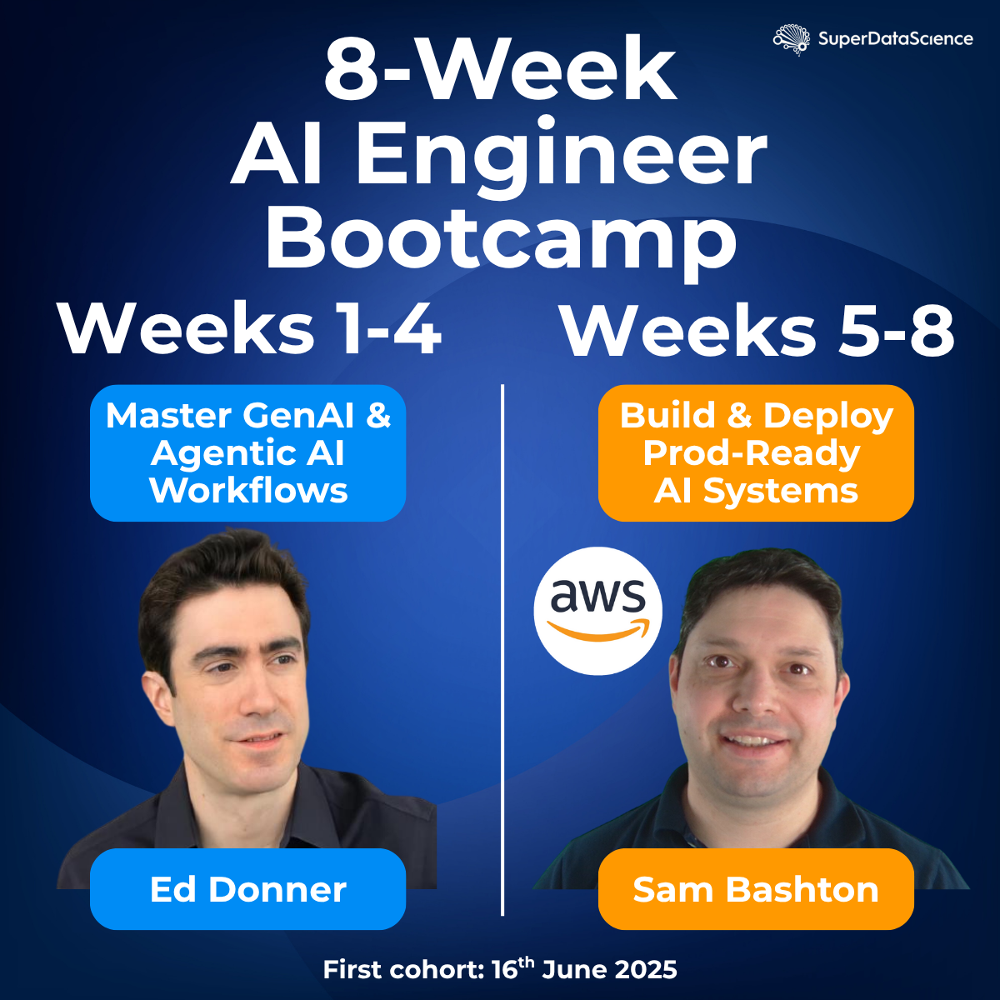

# SuperDataScience AI Bootcamp

## 8 week intensive bootcamp on AI Engineering, Agentic AI,  and Building & Deploying Production AI Systems

_If you're looking at this in Cursor, please right click on the filename in the Explorer on the left, and select "Open preview", to view the formatted version._

I couldn't be more excited to welcome you! This repo is for the first 4 weeks where we immerse ourselves in LLMs and Agents, before you move to building and deploying AI systems for Production.

### Before you begin

I'm here to help you be most successful! Please reach out to me any time for help, on Slack or at [ed@edwarddonner.com](mailto:ed@edwarddonner.com). It's always great to connect with people on LinkedIn to build up the community - you'll find me here:  
https://www.linkedin.com/in/eddonner/  
And this is new to me, but I'm also trying out X/Twitter at [@edwarddonner](https://x.com/edwarddonner) - if you're on X, please show me how it's done 😂  

### The not-so-dreaded setup instructions

Perhaps famous last words: but I really, truly hope that I've put together an environment that will be not too horrific to set up!

- Windows people, your instructions are [here](setup/SETUP-PC.md)
- Mac people, yours are [here](setup/SETUP-mac.md)
- Linux people, yours are [here](setup/SETUP-linux.md)

Any problems, please do contact me.

### Important notes for CrewAI week (Week 3)

Windows PC users: you will need to have checked the "gotcha #4" at the top of the [SETUP-PC](setup/SETUP-PC.md) instructions -- installing Microsoft Build Tools.  
Then, you will need to run this command in a Cursor Terminal in the project root directory in order to run the Crew commands:  
`uv tool install crewai`   
And in case you've used Crew before, it might be worth doing this to make sure you have the latest:  
`uv tool upgrade crewai`  

One more note for Crew:

Windows users: there's a new issue that was recently introduced by one of Crew's libraries. Until this is fixed, you might get a "unicode" error when you try to run `crewai create crew`.  If that happens, please try running this command in the Terminal first: `$env:PYTHONUTF8 = "1"`  

### Super useful resources

- Many essential guides in the [guides](guides/01_intro.ipynb) section
- The [troubleshooting](setup/troubleshooting.ipynb) notebook

### API costs - please read me!

This does involve making calls to OpenAI and other frontier models, requiring an API key and a small spend, which we set up in the SETUP instructions. If you'd prefer not to spend on API calls, there are cheaper alternatives like DeepSeek and free alternatives like using Ollama!

Details are [here](guides/09_ai_apis_and_ollama.ipynb).

Be sure to monitor your API costs to ensure you are totally happy with any spend. For OpenAI, the dashboard is [here](https://platform.openai.com/usage).

### ABOVE ALL ELSE -

Be sure to have fun! You could not have picked a better time to be immersing yourself in LLMs. Please reach out on Slack if I can help at any point. Oh - and did I mention I like [connecting on LinkedIn](https://www.linkedin.com/in/eddonner/) 😂